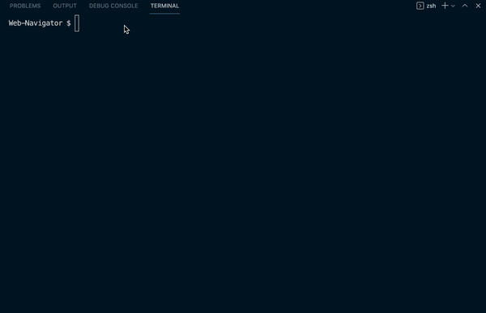

# Web Navigator 
Simulates the navigational operations of a web browser, such as opening a new page and navigating back or forward a page using Stacks and LinkedLists.

## Table of Contents
* [Tools Implemented](#tools-implemented)
* [Installation](#installation)
* [Video of Application](#video-of-application)
* [Credits](#credits)

## Tools Implemented
* JavaScript
* Node.js
* `prompt-syn npm`

## Installation

`npm install`

## Video of Application

## Credits
* Codecademy Project - Pass the Technical Interview with JavaScript